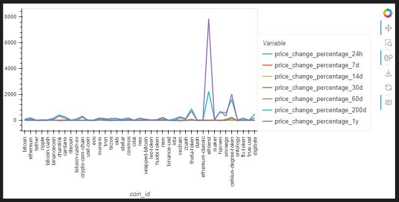
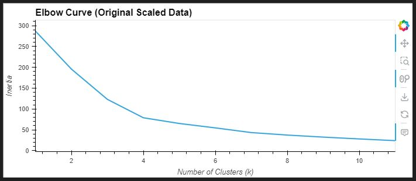
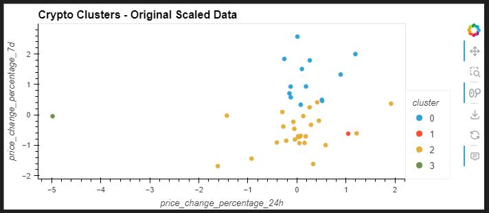
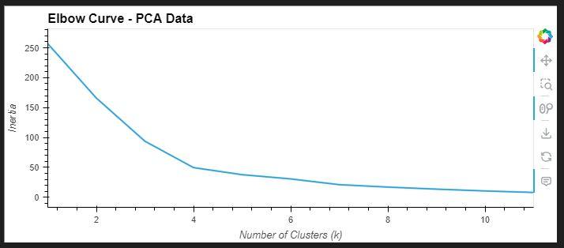
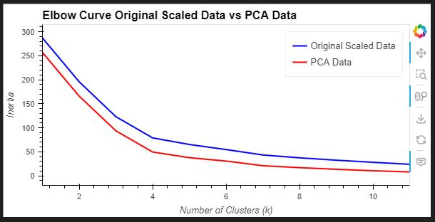
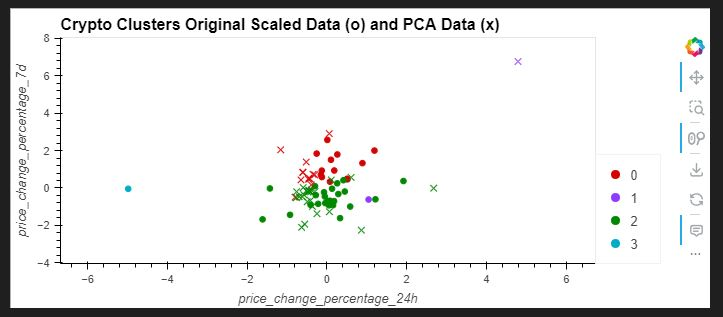

# CryptoClustering

## Prepare the Data
- Use the StandardScaler() module from scikit-learn to normalize the data from the CSV file.
- Create a DataFrame with the scaled data and set the "coin_id" index from the original DataFrame as the index for the new DataFrame.

## Find the Best Value for k Using the Original Scaled DataFrame
### Use the elbow method to find the best value for k using the following steps:
- Create a list with the number of k values from 1 to 11.
- Create an empty list to store the inertia values.
- Create a for loop to compute the inertia with each possible value of k.
- Create a dictionary with the data to plot the elbow curve.
- Plot a line chart with all the inertia values computed with the different values of k to visually identify the optimal value for k.
- Answer the following question in your notebook: What is the best value for k?

## Cluster Cryptocurrencies with K-means Using the Original Scaled Data
### Use the following steps to cluster the cryptocurrencies for the best value for k on the original scaled data:
- Initialise the K-means model with the best value for k.
- Fit the K-means model using the original scaled DataFrame.
- Predict the clusters to group the cryptocurrencies using the original scaled DataFrame.
- Create a copy of the original data and add a new column with the predicted clusters.
- Create a scatter plot using hvPlot as follows:
- Set the x-axis as "PC1" and the y-axis as "PC2".
- Colour the graph points with the labels found using K-means.
- Add the "coin_id" column in the hover_cols parameter to identify the cryptocurrency represented by each data point.

## Optimise Clusters with Principal Component Analysis
- Using the original scaled DataFrame, perform a PCA and reduce the features to three principal components.
- Retrieve the explained variance to determine how much information can be attributed to each principal component and then answer the following question in your notebook: What is the total explained variance of the three principal components?
- Create a new DataFrame with the PCA data and set the "coin_id" index from the original DataFrame as the index for the new DataFrame.

## Find the Best Value for k Using the PCA Data
### Use the elbow method on the PCA data to find the best value for k using the following steps:
- Create a list with the number of k-values from 1 to 11.
- Create an empty list to store the inertia values.
- Create a for loop to compute the inertia with each possible value of k.
- Create a dictionary with the data to plot the Elbow curve.
- Plot a line chart with all the inertia values computed with the different values of k to visually identify the optimal value for k.
- Answer the following question in your notebook:
1. What is the best value for k when using the PCA data?
2. Does it differ from the best k value found using the original data?

## Cluster Cryptocurrencies with K-means Using the PCA Data
### Use the following steps to cluster the cryptocurrencies for the best value for k on the PCA data:
- Initialise the K-means model with the best value for k.
- Fit the K-means model using the PCA data.
- Predict the clusters to group the cryptocurrencies using the PCA data.
- Create a copy of the DataFrame with the PCA data and add a new column to store the predicted clusters.
- Create a scatter plot using hvPlot as follows:
- Set the x-axis as "price_change_percentage_24h" and the y-axis as "price_change_percentage_7d".
- Colour the graph points with the labels found using K-means.
- Add the "coin_id" column in the hover_cols parameter to identify the cryptocurrency represented by each data point.
- Answer the following question:
- What is the impact of using fewer features to cluster the data using K-Means?

# Challenge results

## The dataframe consists of the following plots:

  

## The elbow curve for the original scaled data is:

  

## The clustering for the original scaled data is:

  

## The elbow curve for the PCA data is:

  

## The clustering for the PCA data is:

  

## Analysis

  

### Both curves show a sharp decrease in inertia as the number of clusters increases from 1 to 4, which is typical as more clusters allow for a closer fit to the data.
### After k=4, the rate of decrease in inertia becomes more gradual for both curves, indicating diminishing returns for adding more clusters. This is the "elbow" from which the method gets its name.
### The elbow point for both curves appears to be around k=4, suggesting that four clusters might be a reasonable choice for both original and PCA-processed data.
### The PCA curve is consistently below the original data curve, which suggests that PCA data has lower inertia and thus tighter clusters. This is consistent with the first image where PCA data points appeared more centralized.
### The similarity of the curve shapes also implies that PCA has retained the essential clustering structure of the data, even though it may have reduced the overall dimensionality.

  

### The scatter plot displays clusters of cryptocurrency data with two different methods of preprocessing: original scaled data (represented with 'o' markers) and data transformed by PCA (Principal Component Analysis, represented with 'x' markers).
### The PCA data points are more centered and less spread out than the original scaled data. This could indicate that PCA has reduced the dimensionality of the data in a way that brings similar points closer together in the transformed feature space.
### There is a noticeable overlap between the original and PCA data points for each cluster, which suggests that PCA has preserved the underlying cluster structure of the data.
### Outliers are present in both datasets, but the PCA data seems to pull these points slightly towards the center of the clusters, which might indicate a reduction in the influence of outliers after PCA transformation.

## Summary
### In summary, the PCA appears to effectively simplify the data without losing the clustering characteristics, as shown by the consistent elbow point in the second image and the overlapping clusters in the first image. The PCA transformation seems to provide a more concise representation of the data, potentially improving computational efficiency and possibly reducing the effect of noise or less informative features.

